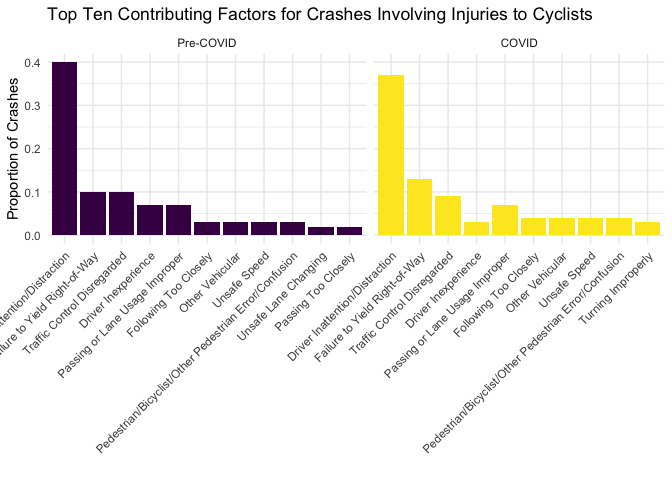

Pull and Tidy
================
11/27/2020

``` r
#cleaning - transpose so vehicle types are listed in one column
crash_dat = 
  crash_dat %>% 
  mutate(
    dow = as.factor(weekdays(crash_date))
  ) %>%
  separate(crash_date, into = c("year", "month", "day"), sep = "-") %>%
  mutate(year = as.integer(year),
         month = as.integer(month),
         day = as.integer(day)) %>%
  pivot_longer(
    vehicle_type_code1:vehicle_type_code_5,
    names_to = "vehicle_number",
    values_to = "vehicle_options",
    names_prefix = "vehicle_type_code"
   ) %>%
  drop_na(vehicle_options)
```

``` r
#Exploring the vehicle types so that we can limit to bicycles -- double check this list
bikes = crash_dat %>%
  filter(str_detect(vehicle_options, "[Bb]ike") | 
           str_detect(vehicle_options, "REVEL") | 
           str_detect(vehicle_options, "SCO")  |
           str_detect(vehicle_options, "MOP")   |
           str_detect(vehicle_options, "ELEC")  |
           str_detect(vehicle_options, "^E-")) %>% 
  filter(vehicle_options != "ESCOVATOR" & vehicle_options != "Bike" &
      str_detect(vehicle_options, "Dirt", negate = TRUE),
      str_detect(vehicle_options, "[Mm]otorbike", negate = TRUE)
           ) 
           
# Run to check what the filter ^ resulted in
# bikes %>%
#   group_by(vehicle_options) %>%
#   count() %>% View()
```

Microvehicle incidents in NYC \_ a leaflet map – I just commented this
out to knit the document

``` r
month_df=
  tibble(
    month = 1:12,
    month_name = factor(month.name, ordered = TRUE, levels = month.name)
  )

fit_injuries_month = crash_dat %>%
  group_by(year) %>%
  mutate(year_2020 = year - 2019) %>%
  nest(data = -month) %>%
  mutate(models = map(data, ~glm(number_of_persons_injured ~ year_2020:borough,
                                 family = "poisson", data = .x)),
         models = map(models, broom::tidy)) %>% 
  select(-data) %>% 
  unnest(models) %>%
  select(month, term, estimate, std.error, p.value) %>% 
  mutate(term = str_replace(term, "year_2020:borough", "2020 v. 2019, Borough: ")) %>%
  left_join(month_df, by = "month") %>%
  select(-month) %>%
  rename(month = month_name) %>%
  select(month, everything())

fit_injuries_month
```

    ## # A tibble: 72 x 5
    ##    month    term                                 estimate std.error  p.value
    ##    <ord>    <chr>                                   <dbl>     <dbl>    <dbl>
    ##  1 January  (Intercept)                            -1.41     0.0143 0.      
    ##  2 January  2020 v. 2019, Borough: BRONX            0.255    0.0354 6.36e-13
    ##  3 January  2020 v. 2019, Borough: BROOKLYN         0.211    0.0282 8.32e-14
    ##  4 January  2020 v. 2019, Borough: MANHATTAN       -0.337    0.0469 7.56e-13
    ##  5 January  2020 v. 2019, Borough: QUEENS           0.150    0.0294 3.27e- 7
    ##  6 January  2020 v. 2019, Borough: STATEN ISLAND    0.683    0.0739 2.59e-20
    ##  7 February (Intercept)                            -1.44     0.0149 0.      
    ##  8 February 2020 v. 2019, Borough: BRONX            0.240    0.0383 3.77e-10
    ##  9 February 2020 v. 2019, Borough: BROOKLYN         0.179    0.0292 9.46e-10
    ## 10 February 2020 v. 2019, Borough: MANHATTAN       -0.180    0.0438 4.05e- 5
    ## # … with 62 more rows

It seems like what this is looking at is the number of persons injured
per crash, and seeing if there is a significant difference between years
(for each month.) Right? So we’re hypothesizing that each crash would be
more dangerous in 2020, (rather than that there are more crashes?) But
sure enough, seems like 2020 is more dangerous overall, interesting\! -
Emma

``` r
fit_injuries_month %>% 
  filter(term != "(Intercept)" & month != "November" & month != "December") %>%
  mutate(term = str_replace(term, "2020 v. 2019, ", "")) %>%
  ggplot(aes(x = month, y = exp(estimate), color = term)) + 
  geom_point(show.legend = FALSE, aes(size = estimate, alpha = .7)) +
  geom_errorbar(aes(ymin = exp(estimate - (1.96*std.error)), 
                    ymax = exp(estimate + (1.96*std.error)))) +
  geom_hline(yintercept = 1, linetype="dashed", 
                color = "darkred", size = 1, alpha = .7) +
  labs(
    title = "Difference in Rate of Injuries Per Crash in 2020 v. 2019",
    x = "Month",
    y = "2020 v. 2019 Difference"
  ) +
  theme(legend.position="right", legend.title = element_blank(),
        text = element_text(size = 10),
        axis.text.x = element_text(angle = 90, hjust = 1, size = 8))
```

<!-- -->

``` r
#for the line plot, we will want a summary of the number of bike crashes by day. The collisions variable calculates the number of unique crashes and the bikes variable calculates the total number of bikes that crashed (there can be mutliple bikes involved in one crash but this is rare)
crash_date_summ = 
  crash_dat %>%
  filter(str_detect(vehicle_options, "[Bb]ike")) %>%
  group_by(year, month, day) %>%
  summarize(
    collisions = n_distinct(collision_id),
    bikes = n()
  )
```

    ## `summarise()` regrouping output by 'year', 'month' (override with `.groups` argument)

``` r
#simple plot just to see what the data look like
crash_date_summ %>%
  ggplot(aes(x = paste(month, day, sep="-"), y = collisions, 
             group = year, color = as.factor(year))) +
  geom_point(alpha = .5) +
  geom_smooth(se = FALSE) + 
  labs(
    title = "Number of Collisions Over Time in January-October of 2019 and 2020",
    x = "Month and Day",
    y = "Number of Collisions"
    ) +
  theme(text = element_text(size = 15), 
        axis.text.x = element_text(angle = 60, hjust=1, size=10)) +
  scale_colour_discrete("Year")
```

    ## `geom_smooth()` using method = 'loess' and formula 'y ~ x'

<!-- -->

``` r
# Make df with aggregate bike counts by day. I noticed that there are some days with NAs - haven't explored yet but might want to look into if the bike counting operation itself was limited at all by covid.
bike_counts_aggregate = 
  bike_dat %>% 
  mutate(
    date_time = date,
    date = lubridate::date(date_time)
  ) %>% 
  group_by(date) %>% 
  summarize(total_daily_bikes = sum(counts, na.rm = TRUE))
```

    ## `summarise()` ungrouping output (override with `.groups` argument)

``` r
# Look at simple graph of bike counts by day, analagous to the one of crashes above.
bike_counts_aggregate %>%
  ggplot(aes(x = date, y = total_daily_bikes)) +
  geom_point(alpha = .5) +
  geom_smooth(se = FALSE)
```

    ## `geom_smooth()` using method = 'loess' and formula 'y ~ x'

<!-- -->

``` r
## Ok, even with the partial fix above, there seem to be bands of missing dates. I think there's something wrong with the import still.
```

Contributing Factor

``` r
crash_factor = 
  bikes %>%
  filter(
    month %in% (3:10),
    number_of_cyclist_injured > 0
    ) %>%
  pivot_longer(
    contributing_factor_vehicle_1:contributing_factor_vehicle_5,
    names_to = "vehicle_factor_num",
    names_prefix = "contributing_factor_vehicle_",
    values_to = "contributing_factor"
   ) %>%
  mutate(
    covid = as.factor(if_else(year == 2019, 'Pre-COVID', 'COVID'))
  ) %>%
  group_by(covid, contributing_factor) %>%
  summarise(
    collisions = n_distinct(collision_id)
  ) %>%
  drop_na(contributing_factor) %>%
  ungroup(contributing_factor) %>%
  filter(contributing_factor != "Unspecified") %>%
  mutate(
    covid = fct_relevel(covid, 'Pre-COVID'),
    proportion = round(collisions / sum(collisions), 2) 
  ) 
```

    ## `summarise()` regrouping output by 'covid' (override with `.groups` argument)

``` r
crash_factor %>%
  group_by(covid) %>%
  top_n(n = 10, wt = proportion) %>%
  mutate(
    contributing_factor = fct_reorder(as.factor(contributing_factor), collisions, .desc = TRUE)
  ) %>%
  ggplot(aes(x = contributing_factor, y = proportion, fill = covid)) +
  geom_bar(stat = "identity") +
  facet_grid( . ~covid, scales = "free_x", space = "free_x") +
  theme(axis.text.x = element_text(angle = 45, vjust = 1, hjust = 1), legend.position = "none") +
  labs(
    title = "Top Ten Contributing Factors for Crashes Involving Injuries to Cyclists",
    x = "",
    y = "Proportion of Crashes"
  )
```

<!-- -->

# Map Visualizations

``` r
crash_map = 
  crash_dat %>% 
  drop_na(c(latitude, longitude)) %>% 
   filter(str_detect(vehicle_options, "[Bb]ike") | 
           str_detect(vehicle_options, "REVEL") | 
           str_detect(vehicle_options, "SCO")  |
           str_detect(vehicle_options, "MOP")   |
           str_detect(vehicle_options, "ELEC")  |
           str_detect(vehicle_options, "^E-")) %>% 
  filter(number_of_persons_injured > 0) %>% 
  filter(borough == "BRONX") %>% 
  mutate(
    text_label = str_c("Crash Time: ", crash_time, "\nNumber of Persons Injured: ", number_of_persons_injured)) %>% 
  plot_mapbox(x = ~longitude, y = ~latitude, color =~number_of_persons_injured, text =~text_label)%>% 
  layout(
    mapbox = list(
      zoom = 9,
      center = list(lat = 40.67, lon = -73.97)))

crash_map
```
