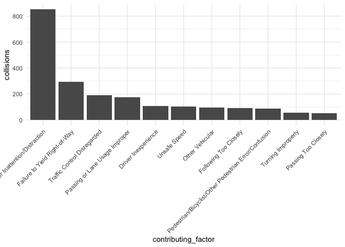

Pull and Tidy
================
11/6/2020

``` r
#cleaning - transpose so vehicle types are listed in one column
crash_dat = 
  crash_dat %>% 
  separate(crash_date, into = c("year", "month", "day"), sep = "-") %>%
  mutate(year=as.integer(year),
         month=as.integer(month),
         day=as.integer(day)) %>%
  pivot_longer(
    vehicle_type_code1:vehicle_type_code_5,
    names_to = "vehicle_number",
    values_to = "vehicle_options"
   ) %>%
  drop_na(vehicle_options)
```

``` r
#Exploring the vehicle types so that we can limit to bicycles -- double check this list
bikes = crash_dat %>%
  filter(str_detect(vehicle_options, "[Bb]ike") | 
           str_detect(vehicle_options, "REVEL") | 
           str_detect(vehicle_options, "SCO")  |
           str_detect(vehicle_options, "MOP")   |
           str_detect(vehicle_options, "ELEC")  |
           str_detect(vehicle_options, "^E-")) %>% 
  filter(vehicle_options != "ESCOVATOR" & vehicle_options != "Bike" &
      str_detect(vehicle_options, "Dirt", negate = TRUE),
      str_detect(vehicle_options, "[Mm]otorbike", negate = TRUE)
           ) 
           
#Run to check what the filter ^ resulted in
# bikes %>%
#   group_by(vehicle_options) %>%
#   count() %>% View()
```

Microvehicle incidents in NYC \_ a leaflet map – I just commented this
out to knit the document

``` r
fit_injuries_month = crash_dat %>%
  group_by(year) %>%
  mutate(year_2020 = year - 2019) %>%
  nest(data = -month) %>%
  mutate(models = map(data, ~glm(number_of_persons_injured ~ year_2020 + borough,
                                 family = "poisson", data = .x)),
         models = map(models, broom::tidy)) %>% 
  select(-data) %>% 
  unnest(models) %>%
  select(month, term, estimate, std.error, p.value) %>% 
  mutate(term = str_replace(term, "^borough", "Borough: "),
         term = str_replace(term, "year_2020", "2020 v. 2019"),
         month = month.abb[month]) 

fit_injuries_month
```

    ## # A tibble: 72 x 5
    ##    month term                   estimate std.error  p.value
    ##    <chr> <chr>                     <dbl>     <dbl>    <dbl>
    ##  1 Jan   (Intercept)             -1.34      0.0263 0.      
    ##  2 Jan   2020 v. 2019             0.139     0.0203 7.94e-12
    ##  3 Jan   Borough: BROOKLYN        0.0226    0.0296 4.45e- 1
    ##  4 Jan   Borough: MANHATTAN      -0.495     0.0382 1.80e-38
    ##  5 Jan   Borough: QUEENS         -0.0364    0.0302 2.28e- 1
    ##  6 Jan   Borough: STATEN ISLAND   0.357     0.0517 4.90e-12
    ##  7 Feb   (Intercept)             -1.36      0.0275 0.      
    ##  8 Feb   2020 v. 2019             0.163     0.0211 1.23e-14
    ##  9 Feb   Borough: BROOKLYN       -0.0302    0.0309 3.29e- 1
    ## 10 Feb   Borough: MANHATTAN      -0.452     0.0386 9.01e-32
    ## # … with 62 more rows

It seems like what this is looking at is the number of persons injured
per crash, and seeing if there is a significant difference between years
(for each month.) Right? So we’re hypothesizing that each crash would be
more dangerous in 2020, (rather than that there are more crashes?) But
sure enough, seems like 2020 is more dangerous overall, interesting\! -
Emma

``` r
fit_injuries_month %>% 
  filter(term == "2020 v. 2019") %>%
  ggplot(aes(x = month, y = exp(estimate))) + geom_point() +
  geom_errorbar(aes(ymin = exp(estimate - (1.96*std.error)), 
                    ymax = exp(estimate + (1.96*std.error)))) +
  labs(
    title = "Rate of Injuries Per Month in 2020 v. 2019",
    x = "Month",
    y = "2020 v. 2019 Difference"
  ) 
```

    ## Warning: Removed 2 rows containing missing values (geom_point).

<!-- -->

``` r
#for the line plot, we will want a summary of the number of bike crashes by day. The collisions variable calculates the number of unique crashes and the bikes variable calculates the total number of bikes that crashed (there can be mutliple bikes involved in one crash but this is rare)
crash_date_summ = 
  crash_dat %>%
  filter(str_detect(vehicle_options, "[Bb]ike")) %>%
  group_by(year, month, day) %>%
  summarize(
    collisions = n_distinct(collision_id),
    bikes = n()
  )
```

    ## `summarise()` regrouping output by 'year', 'month' (override with `.groups` argument)

``` r
#simple plot just to see what the data look like
crash_date_summ %>%
  ggplot(aes(x = paste(month, day, sep="-"), y = collisions, 
             group = year, color = as.factor(year))) +
  geom_point(alpha = .5) +
  geom_smooth(se = FALSE) + 
  labs(
    title = "Number of Collisions Over Time in January-October of 2019 and 2020",
    x = "Month and Day",
    y = "Number of Collisions"
    ) +
  theme(text = element_text(size = 15), 
        axis.text.x = element_text(angle = 60, hjust=1, size=10)) +
  scale_colour_discrete("Year")
```

    ## `geom_smooth()` using method = 'loess' and formula 'y ~ x'

<!-- -->

``` r
#Importing bike data using the NYC Open Data API. The API response is limited to 50,000 rows, so we need a function that can be used to page through these results to capture all bike counts in 2019 and 2020. 

# 
# bike_api = function(offset, limit = 50000) {
#   GET("https://data.cityofnewyork.us/resource/uczf-rk3c.csv", 
#       query = list("$where" = "date between '2019-01-01T00:00:00' and '2020-10-31T12:00:00'", "$limit" = limit, "$offset" = offset)) %>% 
#   content("parsed") %>%
#   as_tibble() 
# }
# 
# 
# offsets = c(25000, 75000, 125000, 175000, 225000, 275000, 325000, 375000, 425000, 475000, 525000, 575000, 625000, 675000, 725000, 775000, 825000, 875000, 925000, 975000)
# bike_dat = bind_rows(bike_api(offset = 0, limit = 25000),
#                     map_df(offsets, bike_api))

## Note: We' were're having a really weird issue with importing the data. It seems that the import works 
## when the offset is 0, 50000, 150000, 250000, 350000, etc. BUT, won't work when it's 100000, 200000 or any other multiple of 100000. 
## It's very strange, and was causing us to have big missing chunks of data. It will even work with 100001, and with 99999, but not 100000.
## I think this partially fixed it, but now it's not importing dates past May. Maybe someone else has an idea?


#I think the code below works
bike_api = function(offset, limit = 50000) {
  GET("https://data.cityofnewyork.us/resource/uczf-rk3c.csv", 
      query = list("$where" = "date between '2019-01-01T00:00:00' and '2020-10-31T12:00:00'", "$limit" = limit, "$offset" = offset)) %>% 
  content("parsed") %>%
  as_tibble() 
}


offsets = seq(0, 900000, by = 50000)
bike_dat = map_df(offsets, bike_api)
```

    ## Parsed with column specification:
    ## cols(
    ##   id1 = col_double(),
    ##   counts = col_double(),
    ##   date = col_datetime(format = ""),
    ##   status = col_double(),
    ##   site = col_double()
    ## )
    ## Parsed with column specification:
    ## cols(
    ##   id1 = col_double(),
    ##   counts = col_double(),
    ##   date = col_datetime(format = ""),
    ##   status = col_double(),
    ##   site = col_double()
    ## )
    ## Parsed with column specification:
    ## cols(
    ##   id1 = col_double(),
    ##   counts = col_double(),
    ##   date = col_datetime(format = ""),
    ##   status = col_double(),
    ##   site = col_double()
    ## )
    ## Parsed with column specification:
    ## cols(
    ##   id1 = col_double(),
    ##   counts = col_double(),
    ##   date = col_datetime(format = ""),
    ##   status = col_double(),
    ##   site = col_double()
    ## )
    ## Parsed with column specification:
    ## cols(
    ##   id1 = col_double(),
    ##   counts = col_double(),
    ##   date = col_datetime(format = ""),
    ##   status = col_double(),
    ##   site = col_double()
    ## )
    ## Parsed with column specification:
    ## cols(
    ##   id1 = col_double(),
    ##   counts = col_double(),
    ##   date = col_datetime(format = ""),
    ##   status = col_double(),
    ##   site = col_double()
    ## )
    ## Parsed with column specification:
    ## cols(
    ##   id1 = col_double(),
    ##   counts = col_double(),
    ##   date = col_datetime(format = ""),
    ##   status = col_double(),
    ##   site = col_double()
    ## )
    ## Parsed with column specification:
    ## cols(
    ##   id1 = col_double(),
    ##   counts = col_double(),
    ##   date = col_datetime(format = ""),
    ##   status = col_double(),
    ##   site = col_double()
    ## )
    ## Parsed with column specification:
    ## cols(
    ##   id1 = col_double(),
    ##   counts = col_double(),
    ##   date = col_datetime(format = ""),
    ##   status = col_double(),
    ##   site = col_double()
    ## )
    ## Parsed with column specification:
    ## cols(
    ##   id1 = col_double(),
    ##   counts = col_double(),
    ##   date = col_datetime(format = ""),
    ##   status = col_double(),
    ##   site = col_double()
    ## )
    ## Parsed with column specification:
    ## cols(
    ##   id1 = col_double(),
    ##   counts = col_double(),
    ##   date = col_datetime(format = ""),
    ##   status = col_double(),
    ##   site = col_double()
    ## )
    ## Parsed with column specification:
    ## cols(
    ##   id1 = col_double(),
    ##   counts = col_double(),
    ##   date = col_datetime(format = ""),
    ##   status = col_double(),
    ##   site = col_double()
    ## )
    ## Parsed with column specification:
    ## cols(
    ##   id1 = col_double(),
    ##   counts = col_double(),
    ##   date = col_datetime(format = ""),
    ##   status = col_double(),
    ##   site = col_double()
    ## )
    ## Parsed with column specification:
    ## cols(
    ##   id1 = col_double(),
    ##   counts = col_double(),
    ##   date = col_datetime(format = ""),
    ##   status = col_double(),
    ##   site = col_double()
    ## )
    ## Parsed with column specification:
    ## cols(
    ##   id1 = col_double(),
    ##   counts = col_double(),
    ##   date = col_datetime(format = ""),
    ##   status = col_double(),
    ##   site = col_double()
    ## )
    ## Parsed with column specification:
    ## cols(
    ##   id1 = col_double(),
    ##   counts = col_double(),
    ##   date = col_datetime(format = ""),
    ##   status = col_double(),
    ##   site = col_double()
    ## )
    ## Parsed with column specification:
    ## cols(
    ##   id1 = col_double(),
    ##   counts = col_double(),
    ##   date = col_datetime(format = ""),
    ##   status = col_double(),
    ##   site = col_double()
    ## )
    ## Parsed with column specification:
    ## cols(
    ##   id1 = col_double(),
    ##   counts = col_double(),
    ##   date = col_datetime(format = ""),
    ##   status = col_double(),
    ##   site = col_double()
    ## )
    ## Parsed with column specification:
    ## cols(
    ##   id1 = col_double(),
    ##   counts = col_double(),
    ##   date = col_datetime(format = ""),
    ##   status = col_double(),
    ##   site = col_double()
    ## )

``` r
# Make df with aggregate bike counts by day. I noticed that there are some days with NAs - haven't explored yet but might want to look into if the bike counting operation itself was limited at all by covid.
bike_counts_aggregate = 
  bike_dat %>% 
  mutate(
    date_time = date,
    date = lubridate::date(date_time)
  ) %>% 
  group_by(date) %>% 
  summarize(total_daily_bikes = sum(counts, na.rm = TRUE))
```

    ## `summarise()` ungrouping output (override with `.groups` argument)

``` r
# Look at simple graph of bike counts by day, analagous to the one of crashes above.
bike_counts_aggregate %>%
  ggplot(aes(x = date, y = total_daily_bikes)) +
  geom_point(alpha = .5) +
  geom_smooth(se = FALSE)
```

    ## `geom_smooth()` using method = 'loess' and formula 'y ~ x'

<!-- -->

``` r
## Ok, even with the partial fix above, there seem to be bands of missing dates. I think there's something wrong with the import still.
```

Contributing Factor

``` r
crash_factor = 
  bikes %>%
  pivot_longer(
    contributing_factor_vehicle_1:contributing_factor_vehicle_5,
    names_to = "vehicle_factor_num",
    names_prefix = "contributing_factor_vehicle_",
    values_to = "contributing_factor"
   ) %>%
  drop_na(contributing_factor) %>%
  filter(contributing_factor != "Unspecified") %>%
  group_by(contributing_factor) %>%
  summarise(
    collisions = n_distinct(collision_id)
  ) %>%
  mutate(
    contributing_factor = fct_reorder(as.factor(contributing_factor), collisions, .desc = TRUE)
  ) 
```

    ## `summarise()` ungrouping output (override with `.groups` argument)

``` r
crash_factor %>%
  filter(
    collisions > 50
  ) %>%
  ggplot(aes(x = contributing_factor, y = collisions)) +
  geom_bar(stat = "identity") +
  theme(axis.text.x = element_text(angle = 45, vjust = 1, hjust = 1))
```

<!-- -->
