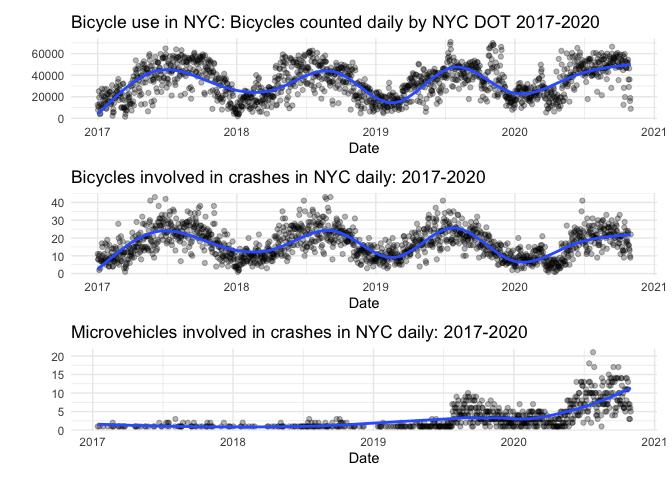

Pull and Tidy
================
11/6/2020

``` r
#cleaning - transpose so vehicle types are listed in one column
crash_dat_tidy = 
  crash_dat %>% 
  mutate(
    date = lubridate::date(crash_date)
  ) %>% 
  mutate(
    dow = as.factor(weekdays(crash_date))
  ) %>%
  separate(crash_date, into = c("year", "month", "day"), sep = "-") %>%
  mutate(year = as.integer(year),
         month = as.integer(month),
         day = as.integer(day)) %>%
  pivot_longer(
    vehicle_type_code1:vehicle_type_code_5,
    names_to = "vehicle_number",
    values_to = "vehicle_options"
   ) %>%
  drop_na(vehicle_options) %>%
  select(date, everything())
```

``` r
#Exploring the vehicle types so that we can limit to bicycles
microvehicle_crash_agg = crash_dat_tidy %>%
  filter(str_detect(vehicle_options, "[Bb]ike") | 
           str_detect(vehicle_options, "REVEL") | 
           str_detect(vehicle_options, "SCO")  |
           str_detect(vehicle_options, "MOP")   |
           str_detect(vehicle_options, "ELEC")  |
           str_detect(vehicle_options, "^E-")) %>% 
  filter(vehicle_options != "ESCOVATOR" & vehicle_options != "Bike" &
      str_detect(vehicle_options, "Dirt", negate = TRUE),
      str_detect(vehicle_options, "[Mm]otorbike", negate = TRUE)
           ) %>% 
  group_by(date) %>% 
  summarize(daily_microveh_crashed = n()) 
```

    ## `summarise()` ungrouping output (override with `.groups` argument)

``` r
bike_crash_agg = crash_dat_tidy %>%
  filter(str_starts(vehicle_options, "[Bb]ike")) %>% 
  group_by(date) %>% 
  summarize(daily_bikes_crashed = n())
```

    ## `summarise()` ungrouping output (override with `.groups` argument)

``` r
month_df=
  tibble(
    month = 1:12,
    month_name = factor(month.name, ordered = TRUE, levels = month.name)
  )

fit_injuries_month = crash_dat_tidy %>%
  group_by(year) %>%
  mutate(year_2020 = year - 2019) %>%
  nest(data = -month) %>%
  mutate(models = map(data, ~glm(number_of_persons_injured ~ year_2020:borough,
                                 family = "poisson", data = .x)),
         models = map(models, broom::tidy)) %>% 
  select(-data) %>% 
  unnest(models) %>%
  select(month, term, estimate, std.error, p.value) %>% 
  mutate(term = str_replace(term, "year_2020:borough", "2020 v. 2019, Borough: ")) %>%
  left_join(month_df, by = "month") %>%
  select(-month) %>%
  rename(month = month_name) %>%
  select(month, everything())

fit_injuries_month
```

    ## # A tibble: 72 x 5
    ##    month    term                                 estimate std.error  p.value
    ##    <ord>    <chr>                                   <dbl>     <dbl>    <dbl>
    ##  1 January  (Intercept)                          -1.37      0.00790 0.      
    ##  2 January  2020 v. 2019, Borough: BRONX          0.0660    0.0155  2.16e- 5
    ##  3 January  2020 v. 2019, Borough: BROOKLYN      -0.00353   0.0106  7.40e- 1
    ##  4 January  2020 v. 2019, Borough: MANHATTAN      0.185     0.0146  1.29e-36
    ##  5 January  2020 v. 2019, Borough: QUEENS         0.0410    0.0114  3.42e- 4
    ##  6 January  2020 v. 2019, Borough: STATEN ISLAND  0.0548    0.0292  6.03e- 2
    ##  7 February (Intercept)                          -1.38      0.00820 0.      
    ##  8 February 2020 v. 2019, Borough: BRONX          0.00114   0.0156  9.42e- 1
    ##  9 February 2020 v. 2019, Borough: BROOKLYN       0.00730   0.0111  5.12e- 1
    ## 10 February 2020 v. 2019, Borough: MANHATTAN      0.190     0.0150  1.02e-36
    ## # … with 62 more rows

``` r
fit_injuries_month %>% 
  filter(term != "(Intercept)" & month != "November" & month != "December") %>%
  mutate(term = str_replace(term, "2020 v. 2019, ", "")) %>%
  ggplot(aes(x = month, y = exp(estimate), color = term)) + 
  geom_point(show.legend = FALSE, aes(size = estimate, alpha = .7)) +
  geom_errorbar(aes(ymin = exp(estimate - (1.96*std.error)), 
                    ymax = exp(estimate + (1.96*std.error)))) +
  geom_hline(yintercept = 1, linetype="dashed", 
                color = "darkred", size = 1, alpha = .7) +
  labs(
    title = "Difference in Rate of Injuries Per Crash in 2020 v. 2019",
    x = "Month",
    y = "2020 v. 2019 Difference"
  ) +
  theme(legend.position="right", legend.title = element_blank(),
        text = element_text(size = 10),
        axis.text.x = element_text(angle = 90, hjust = 1, size = 8))
```

<!-- -->

``` r
#simple plot just to see what the data look like
bike_crash_agg %>%
  separate(date, into = c("year", "month", "day"), sep = "-") %>%
  mutate(year = as.integer(year),
         month = as.integer(month),
         day = as.integer(day)) %>%
  ggplot(aes(x = paste(month, day, sep="-"), y = daily_bikes_crashed, 
             group = year, color = as.factor(year))) +
  geom_point(alpha = .5) +
  geom_smooth(se = FALSE) + 
  labs(
    title = "Number of Daily Bike Collisions Over Time",
    x = "Month and Day",
    y = "Number of Collisions"
    ) +
  theme(text = element_text(size = 10), 
        axis.text.x = element_text(angle = 90, hjust=1, size=2)) +
  scale_colour_discrete("Year")
```

    ## `geom_smooth()` using method = 'loess' and formula 'y ~ x'

<!-- -->

``` r
#Importing bike data using the NYC Open Data API. The API response is limited to 50,000 rows, so we need a function that can be used to page through these results to capture all bike counts in 2019 and 2020. 

bike_api = function(offset, limit = 50000) {
  GET("https://data.cityofnewyork.us/resource/uczf-rk3c.csv", 
      query = list("$where" = "date between '2017-01-01T00:00:00' and '2020-10-31T12:00:00'", "$limit" = limit, "$offset" = offset)) %>% 
  content("parsed") %>%
  as_tibble() 
}

offsets = seq(0, 1800000, by = 50000)
bike_dat = map_df(offsets, bike_api)
```

    ## Parsed with column specification:
    ## cols(
    ##   id1 = col_double(),
    ##   counts = col_double(),
    ##   date = col_datetime(format = ""),
    ##   status = col_double(),
    ##   site = col_double()
    ## )
    ## Parsed with column specification:
    ## cols(
    ##   id1 = col_double(),
    ##   counts = col_double(),
    ##   date = col_datetime(format = ""),
    ##   status = col_double(),
    ##   site = col_double()
    ## )
    ## Parsed with column specification:
    ## cols(
    ##   id1 = col_double(),
    ##   counts = col_double(),
    ##   date = col_datetime(format = ""),
    ##   status = col_double(),
    ##   site = col_double()
    ## )
    ## Parsed with column specification:
    ## cols(
    ##   id1 = col_double(),
    ##   counts = col_double(),
    ##   date = col_datetime(format = ""),
    ##   status = col_double(),
    ##   site = col_double()
    ## )
    ## Parsed with column specification:
    ## cols(
    ##   id1 = col_double(),
    ##   counts = col_double(),
    ##   date = col_datetime(format = ""),
    ##   status = col_double(),
    ##   site = col_double()
    ## )
    ## Parsed with column specification:
    ## cols(
    ##   id1 = col_double(),
    ##   counts = col_double(),
    ##   date = col_datetime(format = ""),
    ##   status = col_double(),
    ##   site = col_double()
    ## )
    ## Parsed with column specification:
    ## cols(
    ##   id1 = col_double(),
    ##   counts = col_double(),
    ##   date = col_datetime(format = ""),
    ##   status = col_double(),
    ##   site = col_double()
    ## )
    ## Parsed with column specification:
    ## cols(
    ##   id1 = col_double(),
    ##   counts = col_double(),
    ##   date = col_datetime(format = ""),
    ##   status = col_double(),
    ##   site = col_double()
    ## )
    ## Parsed with column specification:
    ## cols(
    ##   id1 = col_double(),
    ##   counts = col_double(),
    ##   date = col_datetime(format = ""),
    ##   status = col_double(),
    ##   site = col_double()
    ## )
    ## Parsed with column specification:
    ## cols(
    ##   id1 = col_double(),
    ##   counts = col_double(),
    ##   date = col_datetime(format = ""),
    ##   status = col_double(),
    ##   site = col_double()
    ## )
    ## Parsed with column specification:
    ## cols(
    ##   id1 = col_double(),
    ##   counts = col_double(),
    ##   date = col_datetime(format = ""),
    ##   status = col_double(),
    ##   site = col_double()
    ## )
    ## Parsed with column specification:
    ## cols(
    ##   id1 = col_double(),
    ##   counts = col_double(),
    ##   date = col_datetime(format = ""),
    ##   status = col_double(),
    ##   site = col_double()
    ## )
    ## Parsed with column specification:
    ## cols(
    ##   id1 = col_double(),
    ##   counts = col_double(),
    ##   date = col_datetime(format = ""),
    ##   status = col_double(),
    ##   site = col_double()
    ## )
    ## Parsed with column specification:
    ## cols(
    ##   id1 = col_double(),
    ##   counts = col_double(),
    ##   date = col_datetime(format = ""),
    ##   status = col_double(),
    ##   site = col_double()
    ## )
    ## Parsed with column specification:
    ## cols(
    ##   id1 = col_double(),
    ##   counts = col_double(),
    ##   date = col_datetime(format = ""),
    ##   status = col_double(),
    ##   site = col_double()
    ## )
    ## Parsed with column specification:
    ## cols(
    ##   id1 = col_double(),
    ##   counts = col_double(),
    ##   date = col_datetime(format = ""),
    ##   status = col_double(),
    ##   site = col_double()
    ## )
    ## Parsed with column specification:
    ## cols(
    ##   id1 = col_double(),
    ##   counts = col_double(),
    ##   date = col_datetime(format = ""),
    ##   status = col_double(),
    ##   site = col_double()
    ## )
    ## Parsed with column specification:
    ## cols(
    ##   id1 = col_double(),
    ##   counts = col_double(),
    ##   date = col_datetime(format = ""),
    ##   status = col_double(),
    ##   site = col_double()
    ## )
    ## Parsed with column specification:
    ## cols(
    ##   id1 = col_double(),
    ##   counts = col_double(),
    ##   date = col_datetime(format = ""),
    ##   status = col_double(),
    ##   site = col_double()
    ## )
    ## Parsed with column specification:
    ## cols(
    ##   id1 = col_double(),
    ##   counts = col_double(),
    ##   date = col_datetime(format = ""),
    ##   status = col_double(),
    ##   site = col_double()
    ## )
    ## Parsed with column specification:
    ## cols(
    ##   id1 = col_double(),
    ##   counts = col_double(),
    ##   date = col_datetime(format = ""),
    ##   status = col_double(),
    ##   site = col_double()
    ## )
    ## Parsed with column specification:
    ## cols(
    ##   id1 = col_double(),
    ##   counts = col_double(),
    ##   date = col_datetime(format = ""),
    ##   status = col_double(),
    ##   site = col_double()
    ## )
    ## Parsed with column specification:
    ## cols(
    ##   id1 = col_double(),
    ##   counts = col_double(),
    ##   date = col_datetime(format = ""),
    ##   status = col_double(),
    ##   site = col_double()
    ## )
    ## Parsed with column specification:
    ## cols(
    ##   id1 = col_double(),
    ##   counts = col_double(),
    ##   date = col_datetime(format = ""),
    ##   status = col_double(),
    ##   site = col_double()
    ## )
    ## Parsed with column specification:
    ## cols(
    ##   id1 = col_double(),
    ##   counts = col_double(),
    ##   date = col_datetime(format = ""),
    ##   status = col_double(),
    ##   site = col_double()
    ## )
    ## Parsed with column specification:
    ## cols(
    ##   id1 = col_double(),
    ##   counts = col_double(),
    ##   date = col_datetime(format = ""),
    ##   status = col_double(),
    ##   site = col_double()
    ## )
    ## Parsed with column specification:
    ## cols(
    ##   id1 = col_double(),
    ##   counts = col_double(),
    ##   date = col_datetime(format = ""),
    ##   status = col_double(),
    ##   site = col_double()
    ## )
    ## Parsed with column specification:
    ## cols(
    ##   id1 = col_double(),
    ##   counts = col_double(),
    ##   date = col_datetime(format = ""),
    ##   status = col_double(),
    ##   site = col_double()
    ## )
    ## Parsed with column specification:
    ## cols(
    ##   id1 = col_double(),
    ##   counts = col_double(),
    ##   date = col_datetime(format = ""),
    ##   status = col_double(),
    ##   site = col_double()
    ## )
    ## Parsed with column specification:
    ## cols(
    ##   id1 = col_double(),
    ##   counts = col_double(),
    ##   date = col_datetime(format = ""),
    ##   status = col_double(),
    ##   site = col_double()
    ## )
    ## Parsed with column specification:
    ## cols(
    ##   id1 = col_double(),
    ##   counts = col_double(),
    ##   date = col_datetime(format = ""),
    ##   status = col_double(),
    ##   site = col_double()
    ## )
    ## Parsed with column specification:
    ## cols(
    ##   id1 = col_double(),
    ##   counts = col_double(),
    ##   date = col_datetime(format = ""),
    ##   status = col_double(),
    ##   site = col_double()
    ## )
    ## Parsed with column specification:
    ## cols(
    ##   id1 = col_double(),
    ##   counts = col_double(),
    ##   date = col_datetime(format = ""),
    ##   status = col_double(),
    ##   site = col_double()
    ## )
    ## Parsed with column specification:
    ## cols(
    ##   id1 = col_double(),
    ##   counts = col_double(),
    ##   date = col_datetime(format = ""),
    ##   status = col_double(),
    ##   site = col_double()
    ## )
    ## Parsed with column specification:
    ## cols(
    ##   id1 = col_double(),
    ##   counts = col_double(),
    ##   date = col_datetime(format = ""),
    ##   status = col_double(),
    ##   site = col_double()
    ## )
    ## Parsed with column specification:
    ## cols(
    ##   id1 = col_double(),
    ##   counts = col_double(),
    ##   date = col_datetime(format = ""),
    ##   status = col_double(),
    ##   site = col_double()
    ## )
    ## Parsed with column specification:
    ## cols(
    ##   id1 = col_double(),
    ##   counts = col_double(),
    ##   date = col_datetime(format = ""),
    ##   status = col_double(),
    ##   site = col_double()
    ## )

``` r
bike_counts_aggregate = 
  bike_dat %>% 
  mutate(
    date_time = date,
    date = lubridate::date(date_time)
  ) %>% 
  group_by(date) %>% 
  summarize(total_daily_bikes = sum(counts, na.rm = TRUE))
```

    ## `summarise()` ungrouping output (override with `.groups` argument)

## Visualization option 1:

One way of visualizing: 2017-2020 Bike use, bikes involved in crashes,
microvehicles involved in crashes. I thought it would be valuable to go
back to 2017 to get a sense of non-covid bike use to compare to 2020.

This will need to have an aspect ratio tall enough to show all three
clearly.

``` r
microveh_crash_plot = microvehicle_crash_agg %>% 
  ggplot(aes(x = date, y = daily_microveh_crashed)) +
  geom_point(alpha = .3) +
  geom_smooth(se = FALSE) +
  labs(
    title = "Microvehicles involved in crashes in NYC daily: 2017-2020",
    x = "Date",
    y = ""
  )

bike_crash_plot = bike_crash_agg %>% 
  ggplot(aes(x = date, y = daily_bikes_crashed)) +
  geom_point(alpha = .3) +
  geom_smooth(se = FALSE) +
  labs(
    title = "Bicycles involved in crashes in NYC daily: 2017-2020",
    x = "Date",
    y = ""
  )
  
bike_count_plot = bike_counts_aggregate %>%
  ggplot(aes(x = date, y = total_daily_bikes)) +
  geom_point(alpha = .3) +
  geom_smooth(se = FALSE) +
  labs(
    title = "Bicycle use in NYC: Bicycles counted daily by NYC DOT 2017-2020",
    x = "Date",
    y = ""
  )

bike_count_plot / bike_crash_plot / microveh_crash_plot
```

    ## `geom_smooth()` using method = 'gam' and formula 'y ~ s(x, bs = "cs")'
    ## `geom_smooth()` using method = 'gam' and formula 'y ~ s(x, bs = "cs")'

    ## `geom_smooth()` using method = 'loess' and formula 'y ~ x'

<!-- -->

## Visualization option 2: Overlay years for bike use, overlay years for bike crashes

**Still to do for both plots: change x-axis labels, Adjust colors so
2020 isn’t yellow…**

Plotly plot of daily bike counts.

``` r
bike_count_yr_plot = bike_counts_aggregate %>% 
  mutate(year = lubridate::year(date),
         month = lubridate::month(date),
         day_of_year = lubridate::yday(date)) %>%
  ggplot(aes(x = day_of_year, y = total_daily_bikes, 
             group = year, color = as.factor(year))) +
  geom_point(alpha = .3) +
  geom_smooth(se = FALSE) + 
  labs(
    title = "Bicycles counted daily by NYC DOT 2017-2020",
    x = "Month and Day",
    y = "Number of Collisions"
    ) +
  theme(text = element_text(size = 15), 
        axis.text.x = element_text(angle = 60, hjust=1, size=10)) +
  scale_colour_discrete("Year")

#ggplotly(bike_count_yr_plot)
```

Analagous plot of bikes involved in crashes:

``` r
bike_crash_yr_plot = bike_crash_agg %>% 
    mutate(year = lubridate::year(date),
         month = lubridate::month(date),
         day_of_year = lubridate::yday(date)) %>% 
  ggplot(aes(x = day_of_year, y = daily_bikes_crashed, 
             group = year, color = as.factor(year))) +
  geom_point(alpha = .3) +
  geom_smooth(se = FALSE) + 
  labs(
    title = "Bicycles involved in crashes daily in NYC 2017-2020",
    x = "Month and Day",
    y = "Bikes involved in crashes"
    ) +
  theme(text = element_text(size = 15), 
        axis.text.x = element_text(angle = 60, hjust=1, size=10)) +
  scale_colour_discrete("Year")

#ggplotly(bike_crash_yr_plot)
```

Notes: bicycle use in 2020 seems comparable, and at some points slightly
higher than bike use in previous years. However, bicycle crashes were
lower than in previous years. It’s hard to know if this is due to an
improvement in bicycle safety in general or if reduced car traffic
during covid had an impact.

Contributing Factor

``` r
crash_factor = 
  crash_dat_tidy %>%
  filter(str_detect(vehicle_options, "[Bb]ike")
           ) %>%
  filter(
    month %in% (3:10),
    number_of_cyclist_injured > 0
    ) %>%
  pivot_longer(
    contributing_factor_vehicle_1:contributing_factor_vehicle_5,
    names_to = "vehicle_factor_num",
    names_prefix = "contributing_factor_vehicle_",
    values_to = "contributing_factor"
   ) %>%
  mutate(
    covid = as.factor(if_else(year == 2019, 'Pre-COVID', 'COVID'))
  ) %>%
  group_by(covid, contributing_factor) %>%
  summarise(
    collisions = n_distinct(collision_id)
  ) %>%
  drop_na(contributing_factor) %>%
  ungroup(contributing_factor) %>%
  filter(contributing_factor != "Unspecified") %>%
  mutate(
    covid = fct_relevel(covid, 'Pre-COVID'),
    proportion = round(collisions / sum(collisions), 2) 
  ) 
```

    ## `summarise()` regrouping output by 'covid' (override with `.groups` argument)

``` r
crash_factor %>%
  group_by(covid) %>%
  top_n(n = 10, wt = proportion) %>%
  mutate(
    contributing_factor = fct_reorder(as.factor(contributing_factor), collisions, .desc = TRUE)
  ) %>%
  ggplot(aes(x = contributing_factor, y = proportion, fill = covid)) +
  geom_bar(stat = "identity") +
  facet_grid( . ~covid, scales = "free_x", space = "free_x") +
  theme(axis.text.x = element_text(angle = 45, vjust = 1, hjust = 1), legend.position = "none") +
  labs(
    title = "Top Ten Contributing Factors for Crashes Involving Injuries to Cyclists",
    x = "",
    y = "Proportion of Crashes"
  )
```

<!-- -->
