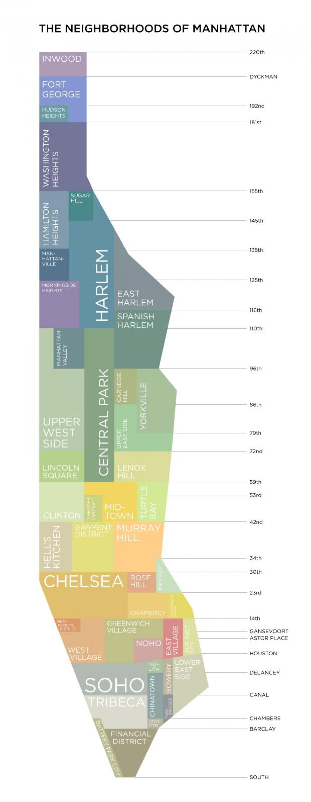

```{r setup, include = FALSE}

library(tidyverse)
library(httr)
library(plotly)
library(readr)
library(knitr)

knitr::opts_chunk$set(echo = FALSE, message = FALSE, warning = FALSE)

theme_set(theme_minimal() + theme(legend.position = "bottom"))
options(
  ggplot2.continuous.colour = "viridis",
  ggplot2.continuous.fill = "viridis"
)
scale_colour_discrete = scale_color_viridis_d
scale_fill_discrete = scale_fill_viridis_d

# setting user, api key and access token
Sys.setenv("plotly_username"="aabramov90")

Sys.setenv("plotly_api_key"="TcaNTrLIJVEJyrUlhXgd")

Sys.setenv('MAPBOX_TOKEN' = 'pk.eyJ1IjoiYWFicmFtb3Y5MCIsImEiOiJja2k5aHQ4ZWswZnhmMnNtcDJ0b2FlZzdjIn0.QcpV6ynhO9mlLga7CvUJwA')

```

```{r, import}
# Importing data
crash_dat = read_csv("./data/crash_dat.csv")

# Fitering
microvehicles = 
  crash_dat %>% 
  drop_na(c(latitude, longitude, borough)) %>% 
  filter(
    year > 2018,
    latitude > 0) %>%  
  filter(str_detect(vehicle_options, "[Bb]ike") | 
           str_detect(vehicle_options, "REVEL") | 
           str_detect(vehicle_options, "SCO")  |
           str_detect(vehicle_options, "MOP")   |
           str_detect(vehicle_options, "ELEC")  |
           str_detect(vehicle_options, "^E-")) %>% 
  filter(vehicle_options != "ESCOVATOR")
```


```{r}
microvehicles_count_bikes = 
  crash_dat %>% 
  drop_na(c(latitude, longitude, borough)) %>% 
  filter(
    year > 2018,
    latitude > 0) %>%  
  filter(str_detect(vehicle_options, "[Bb]ike"))
```


```{r}
microvehicles_count_mv_injuries = 
  crash_dat %>% 
  drop_na(c(latitude, longitude, borough)) %>% 
  filter(year > 2018,
         number_of_motorist_injured >0) %>% 
  filter(str_detect(vehicle_options, "REVEL") |
           str_detect(vehicle_options, "SCO") |
           str_detect(vehicle_options, "MOP") |
           str_detect(vehicle_options, "ELEC") |
           str_detect(vehicle_options, "^E-")) %>% 
  filter(vehicle_options != "ESCOVATOR")
```

```{r}
microvehicles_count_bike_injuries = 
  crash_dat %>% 
  drop_na(c(latitude, longitude, borough)) %>% 
  filter(year > 2018,
         str_detect(vehicle_options, "[Bb]ike"),
         number_of_cyclist_injured >0)
```


```{r}
microvehicles_count_mv = 
  crash_dat %>% 
  drop_na(c(latitude, longitude, borough)) %>% 
  filter(
    year > 2018,
    latitude > 0) %>%  
  filter(str_detect(vehicle_options, "REVEL") | 
           str_detect(vehicle_options, "SCO")  |
           str_detect(vehicle_options, "MOP")   |
           str_detect(vehicle_options, "ELEC")  |
           str_detect(vehicle_options, "^E-")) %>% 
  filter(vehicle_options != "ESCOVATOR") 
```

# Count Data

There are a total of `r nrow(microvehicles)` incidents analyzed in this dataset with complete location data in 2019 and 2020.  

### Bikes
Of those crashes, `r nrow(microvehicles_count_bike_injuries)` involved bicycles  with cyclists injured.  

### Microvehicles
Of those crashes, `r nrow(microvehicles_count_mv_injuries)` involved microvehicles with motorists  injured. 

# Maps

## Data and Design

These maps include data provided by the City of New York available in the [open source crash database]("https://data.cityofnewyork.us/Public-Safety/Motor-Vehicle-Collisions-Crashes/h9gi-nx95") and are generated by [Plotly Chart Studio]("https://plotly.com/chart-studio"/) and [Mapbox]("https://www.mapbox.com/") geolocation software.  

## Manhattan Map Reference

For reference, here is a helpful map of the neighborhoods in Manhattan.

[Source:  MapsManhattan]("https://maps-manhattan.com/manhattan-neighborhood-map")


```{r, echo=FALSE, out.width="50%", fig.cap="Manhattan Map", fig.align = 'center'}

```

# Bicycles

With ongoing road improvements and the construction of more bike lanes in New York City in an effort to promote safety, more New Yorkers are traveling by bike.  

```{r, echo=FALSE, out.width="50%", fig.cap="Bike Lane", fig.align = 'center'}
knitr::include_graphics("./data/bike_lane.jpg")
```
[Source:  CurbedNY]("https://ny.curbed.com/2018/12/19/18148685/nyc-protected-bike-lane-expansion-vision-zero-2018")

## Cyclist Injuries

This map displays the geolocation of cyclist injuries in New York City from January 2019 to November 2020. 
The data are interactive and organized by borough and also split by year. Data are not available on the severity of the cyclist's injuries.  

```{r, fig.width=8}
map_cyclists_injured =  
  microvehicles %>% 
  filter(
    number_of_cyclist_injured > 0) %>%
  mutate(
    covid = as.factor(if_else(year == 2019, 'Pre-COVID', 'COVID')),
    text_label = str_c("Number Injured: ", number_of_cyclist_injured)) %>% 
  plot_mapbox(
    lon = ~longitude, 
    lat = ~latitude, 
    split = ~year, 
    size = ~number_of_cyclist_injured,
    color = ~borough,
    mode = 'markers',
    text = ~text_label) %>% 
  layout(
    mapbox = 
      list(
        style = 'dark',
        zoom = 9.5, 
        center = list(lat = 40.71, lon = -73.97)),
    title = "Crashes with Cyclists Injured in New York City 2019 - 
    2020",
    width = 900)

map_cyclists_injured %>% config(mapboxAccessToken = Sys.getenv("MAPBOX_TOKEN"))
```

### Year to Year Comparison

There appear to some incremental changes in the geolocation of cyclist injuries between 2019 and 2020, including an increase in clustering in the South Bronx in 2020, relative to 2019.  Further, data from Queens suggest relatively more cyclist injuries are occurring in the Jackson Heights neighborhood and also appear more scattered in 2020, when compared to 2019.  

### Neighborhood Clustering

Relative areas of clustering are noted in several Manhattan neighborhoods including East Harlem, as well as the East Village and Lower East Side. In addition, the South Bronx, Williamsburg and Jackson Heights neighborhoods also appear to have a relatively high incidence of cyclist injuries in 2019 and 2020. 

Staten Island appears to report relatively few cyclist injuries, when compared to the other four boroughs.  
In Manhattan, the Morningside Heights and Upper West Side neighborhoods appear to be areas relatively safer for cyclists. Other neighbhorhoods with relatively fewer cyclist injuries include the Astoria neighborhood in Queens as well as the waterfront areas of the Bronx, Brooklyn and Queens.

# Microvehicles (MV)

Microvehicles broadly include two wheeled devices such as battery powered e-bikes, e-scooters, and mopeds. 
Citing recent trends in increased affordability and more ride sharing services such as [Revel]("https://gorevel.com/new-york/"), relatively more New Yorkers are traveling by these means. 

These vehicles also provide an important alternative to using public transportation. Considering the contagious spread of SARS-COV2 in crowded indoor settings, essential workers in New York considered these means of transport to limit their risk of contracting the virus.  

## MV-related Crashes with Motorists Injured

This map displays the geolocation of microvehicle-related motorist injuries in New York City from January 2019 to November 2020. The data are interactive and organized by borough and also split by year. Data are not available on the severity of the motorist's injuries or which vehicle the motorist was traveling in.  

```{r, fig.width=8}
map_motorist_injured = 
  microvehicles %>% 
  filter(
    number_of_motorist_injured > 0,
    borough != "Staten Island") %>%
  mutate(
    covid = as.factor(if_else(year == 2019, 'Pre-COVID', 'COVID')),
    text_label = 
      str_c("Time Period: ", year))  %>% 
  plot_mapbox(
    lon = ~longitude, 
    lat = ~latitude, 
    split = ~year,
    mode = 'markers',
    text = ~text_label) %>% 
  layout(
    mapbox = 
      list(
        style = 'dark',
        zoom = 9.5, 
           center = list(lat = 40.71, lon = -73.97)),
    title = "Microvehicle-Related Motorists Injured in New York City 2019 - 2020",
    width = 900)

map_motorist_injured %>% config(mapboxAccessToken = Sys.getenv("MAPBOX_TOKEN"))
```


### Year to Year Comparison 

There appear to more microvehicle-related crashes with motorists injured 2019 and 2020.

### Neighborhood Clustering 

The data suggest an increased incidence of microvehicle-related incidents with motorists injured specically in the Bronx and East Harlem in 2020, when compared to  2019. 

These data may be related to the rollout of Revel mopeds in 2020 which began offering a [newly expanded ride-sharing service]("https://nyc.streetsblog.org/2020/03/26/revel-scooters-quietly-creates-new-manhattan-service-area/") in the Bronx and Northern Manhattan in March of 2020.  Note that these data are only a graphical representation of the data and no statistical analysis was performed.  


## Bicycle and MV-Related Crashes with Deaths

This map displays the geolocation of bicycle and microvehicle-related deaths in New York City from January 2019 to November 2020. The data are interactive and organized by borough and also split by year. These data report fatal injuries at the time of the incident and may not include fatalities from hospitalized trauma patients.    

```{r, fig.width=8}
map_fatalities = 
  microvehicles %>% 
  filter(
    number_of_persons_killed > 0) %>% 
  plot_mapbox(
    lon = ~longitude, 
    lat = ~latitude, 
    split = ~year, 
    color = ~borough,
    mode = 'markers',
    hoverinfo = 'skip') %>% 
  layout(
    mapbox = 
      list(
        style = 'dark',
        zoom = 9.5, 
           center = list(lat = 40.71, lon = -73.97)),
    title = "Fatalities involving Microvehicles and Bicycles in New York City 2019 - 2020",
    width = 900)

map_fatalities %>% config(mapboxAccessToken = Sys.getenv("MAPBOX_TOKEN"))
```

# Density Heatmaps

## Data and Design

These maps include data provided by the City of New York available in the [open source crash database]("https://data.cityofnewyork.us/Public-Safety/Motor-Vehicle-Collisions-Crashes/h9gi-nx95") and are generated by [Plotly Chart Studio]("https://plotly.com/chart-studio"/) and [Mapbox]("https://www.mapbox.com/") geolocation software and further analyzed with a variable binding density function.  

### Density of Bicycle Crashes with Cyclists Injured in 2019

```{r, fig.width=8}
map_cyclist_density_2019 = 
  microvehicles %>% 
  filter(
    str_detect(vehicle_options, "[Bb]ike"),
    year == "2019",
    number_of_cyclist_injured > 0) %>% 
  plot_ly(
    lon = ~longitude, 
    lat = ~latitude,  
    type = 'densitymapbox',
    radius = 3) %>% 
  layout(
    mapbox = 
      list(
        style = 'streets',
        zoom = 9.5,
        center = list(lat = 40.71, lon = -73.97)),
      title = "Density Heatmap of Cyclist Injuries in 2019")

map_cyclist_density_2019 %>% config(mapboxAccessToken = Sys.getenv("MAPBOX_TOKEN"))
```

### Density of Bicycle Crashes with Cyclists in 2020

```{r, fig.width=8}
map_cyclist_density_2020 = 
  microvehicles %>% 
  filter(
    str_detect(vehicle_options, "[Bb]ike"),
    year == "2020",
    number_of_cyclist_injured > 0) %>% 
  plot_ly(
    lon = ~longitude, 
    lat = ~latitude,  
    type = 'densitymapbox',
    radius = 3) %>% 
  layout(
    mapbox = 
      list(
        style = 'streets',
        zoom = 9.5,
        center = list(lat = 40.71, lon = -73.97)),
      title = "Density Heatmap of Cyclist Injuries in 2020")

map_cyclist_density_2020 %>% config(mapboxAccessToken = Sys.getenv("MAPBOX_TOKEN"))

```

### Year to Year Comparison

The data in these density plots suggest there are relatively more crashes with cyclists injured in downtown Manhattan in 2019 and 2020.  Further, there appears to be a relative increase in the Jackson Heights commmunity in 2020.  

# Summary

Data in these geolocation and density heatmap plots help identify certain neighborhoods in New York City that appear to be relatively more dangerous to cyclists.  They include  Manhattan's East Village and Lower East Side, as well as the Jackson Heights area of Queens. Further, the maps suggest a relative increase in the incidence of microvehicle-related motorist injuries in the South Bronx and the East Harlem neighborhood when comparing 2020 to 2019.  