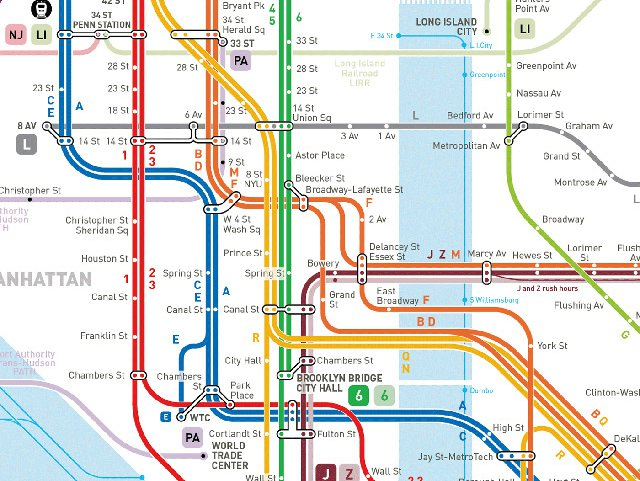
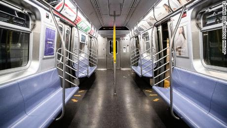

# Introduction and Background

New York City has and maybe always will be a challenging place to live for many -- and traveling around the Big Apple is no exception. 


Commuting in rush hour traffic on New York’s bridges, tunnels and busy streets can be an exhausting experience.  

Seen for the first time, the [subway map](https://new.mta.info/map/7551) can appear daunting. 

```{r, echo=FALSE, out.width="50%", fig.cap="NYC Subway Map", fig.align = 'center'}

```


One solution, for some, seems to be riding a bike.  Or maybe something with a little boost, like an e-bike, or a moped.  

## Bicycles

[CitiBike](https://www.citibikenyc.com/), a well known bike rental program with bike stations around the city offer a convenient solution for getting around without having to own (or deal with parking) a bike.  The service also offers e-bikes and has been [growing](https://www.citibikenyc.com/blog/major-citi-bike-expansion-map-revealed).  

```{r, echo=FALSE, out.width="50%", fig.cap="Citi e-Bike", fig.align = 'center'}

```

[Source:  Citi e-Bike](https://www.citibikenyc.com/how-it-works/electric)

Over the last few years, the New York City Department of Transportation partnered with the Regional Planning Association and the Bikeway Advisory Committee to construct more bike lanes to promote cyclist safety. The [Vision Zero](https://www1.nyc.gov/content/visionzero/pages/) Task Force aims to reduce traffic-related fatalities and deaths and has been a driving force for street redesign initiatives that have improved safety and have promoted alternative forms of transportation.  


## Mopeds

Along similar lines, [Revel](https://gorevel.com/new-york/) recently arrived in New York offering an app-based electric moped sharing program.  These electric mopeds require a driver’s license and travel up to 25mph, but are only permitted in certain zones.  

```{r, echo=FALSE, out.width="50%", fig.cap="Go Revel", fig.align = 'center'}

```

[Go Revel](https://gorevel.com/wp-content/uploads/2019/05/stacked-image-pricing2.jpg)

## Covid-19

The impact of the Covid-19 surge on New York City was felt in every neighborhood and was shared by all. Essential workers continued coming to work, but many feared they might contract the still largely unknown virus on public transport.  Today, MTA ridership remains at [all-time lows](
https://new.mta.info/coronavirus/ridership). Some workers turned to bicycles, e-bikes, e-scooters and electric mopeds as an alternative, but safety remained a concern.  

```{r, echo=FALSE, out.width="75%", fig.cap="NYC Subway", fig.align = 'center'}

```


# Initial Questions

In this data science project, completed by graduate students in the Columbia University Mailman School of Public Health, we analyzed the [New York City OpenData crash database](https://data.cityofnewyork.us/Public-Safety/Motor-Vehicle-Collisions-Crashes/h9gi-nx95)  to better understand trends in motor vehicle collisions and related injuries and deaths.  

Here we intend to provide an in-depth look at New York City’s crash database with an exploratory data analysis, in addition to visualizations (plots, heatmaps, geolocation mapping) and statistical analysis.
At first, we wondered if the incidence of electric moped crashes with injuries increased in 2020, compared to 2019.  

## Evolution of the Project

However, this project expanded over time, as we familiarized ourselves with the dataset. For example, we also wondered about the supposed increased use of bicycles, e-bikes, and e-scooters, or whether there were changes in the rates of accidents depending on the time of the day or month of the year, and more.

To address these varied questions, we each took on a different component of the project. Specifically, we examined the location of these crashes using geolocation maps, time trends (by year and seasonal trends), contributing factors (including clustering by time of day), rates of injury in 2020 v. 2019, and worked to predict the number of incidents based on weather.

# Related work

We initially came up with this idea after people around New York City were commenting on how many motorists were seen riding on the electric mopeds unsafely without helmets. 

Revel [expanded](https://nyc.streetsblog.org/2020/03/26/revel-scooters-quietly-creates-new-manhattan-service-area/) rather quickly into new neighborhoods during the Covid-19 surge. Over time, more anecdotal stories emerged about electric mopeds driving on sidewalks and running red lights.  Soon thereafter, the New York Times published this  [article](https://www.nytimes.com/2020/07/28/nyregion/revel-scooters-death-nyc.html)  that reported on deaths related to motorists riding on Revel’s electric scooters and the service was shut down citing safety concerns. 

# Data

The two primary data sources for this project were the New York City (NYC) Department of Transportation (DOT) Motor Vehicle Collisions - Crashes data and the NYC DOT Bicycle Counts data. These data were obtained from the NYC Open Data  [portal](https://data.cityofnewyork.us/Public-Safety/Motor-Vehicle-Collisions-Crashes/h9gi-nx95)   through the Socrata Open Data API (SODA). Since both data sources exceed the row limit of the API, we created functions that made requests to the API, querying for our dates of interest (2017 - October 2020) and using the limit and offset parameters. We then iteratively (using `map()`) called these functions to pull and stack all necessary data.

The Motor Vehicle Collisions - Crashes data contain information on all police-reported crashes that occur within NYC. Police-reported crashes include collisions that result in an injury, death, or at least $1,000 of property damage. Each row in the dataset represents a unique crash, which is identified by the collision ID. Key variables from this dataset that were used in our analyses include:

* Crash date
* Crash time
* Borough
* Latitude
* Longitude
* Number of persons injured
* Number of cyclist injured
* Vehicle type 1-5
* Contributing factor vehicle 1-5

Each crash can involve multiple vehicles, which are identified in the vehicle type code 1-5 variables. To tidy this dataset and subset to bikes and microvehicles, we transposed the data from wide to long format to create a single vehicle type variable and filtered to vehicle types that aligned with our definition of bikes and microvehicles using the str_detect function. We also created a filtering function that was used in each analysis to distinguish microvehicles from bikes. We further tidied the collisions dataset for the contributing factor analyses by transposing the contributing factor variables, which are designated for each vehicle involved in the collision by the responding crash investigator.
The Bicycle Counts data contain information on bike counts that are conducted at designated locations throughout NYC. Bikes are counted through automated counters that can measure bike volume on a continuous basis at 14 locations throughout the city. Key variables from this dataset that were used in our analyses include:

* Date
* Counts

The bike count data were cleaned by grouping by date and summing the total count of bikes across the 14 locations. 

# Exploratory Analysis

For our exploratory analyses, we aimed to observe patterns related to bicycle and microvehicle crashes from several different angles, with a particular interest in exploring whether there were observable changes in the context of the COVID lockdown in NYC. The exploratory analyses consisted of three major parts: visualizations of crashes and bike use over time, maps of crashes taking place in NYC before and after March of 2020, and summary and visualizations of factors contributing to crashes pre and post March as well as daily patterns.

## Visualizations over time

In order to get a birds-eye view of whether patterns of bicycle and microvehicle crashes changed in the context of the COVID-19 pandemic, we created several visualizations of crashes over time. Initially we aggregated the number of crashes and observed bikes to the day level, and plotted city-wide bicycle crashes, microvehicle crashes, and bicycle counts from 2019-2020. Subsequently, we extended the date range to the beginning of 2017 in order to get a better sense of normal variation in bike/microvehicle crashes and use. As expected, we observed a strong seasonal pattern in bike use and crashes, with higher use and crashes in the summer months.

In order to look at any differences between 2020 and prior years in more detail, we also looked at several plots from January through December with each year overlaid. Bicycle crashes in 2020 followed, as we expected, a similar curve to bicycle use as quantified by the DOT bike counts. Interestingly, however, crashes seemed to be offset lower than prior years compared to bicycle use, suggesting that bicycles may have been involved in crashes at a lower rate per bike than previous years. To observe this possible pattern more directly, we also include a plot of crashes per bicycle counted, which shows more clearly that crashes per bicycle seem to dip starting in the middle of 2019, and remain lower than previous years through mid 2020. 

## Mapping

We considered the geolocation of bicycle and microvehicle crashes and wanted to identify possible location trends between 2019 and 2020. Data in these geolocation and density heatmap plots helped identify certain neighborhoods in New York City that appear to be relatively more dangerous to cyclists and they include Manhattan's East Village and Lower East Side, as well as the Jackson Heights area of Queens. Further analysis of interest may include studying the relative usage of bikes in the discussed neighbborhoods and assess for the availability of bike lanes and other measures designed to promote bicycle safety.  

The scatter maps focusing on microvehicle-related motorist injuries suggest a relative increase in the incidence of crashes with injuries occurring in the South Bronx and the East Harlem neighborhood when we compared 2020 to 2019.  While no statistical analysis was performed to assess the significance of these findings, we note that the Revel electric moped sharing service was expanded to the South Bronx and Northern Manhattan zones in March 2020. 
 
## Contributing factors

The goal of the contributing factor analyses was to understand whether there have been changes in contributing factors of bike and microvehicle crashes during the COVID-19 pandemic as compared to prior to the pandemic. We hypothesized that there would be changes in contributing factors due to changes in traffic patterns as a result of the pandemic. In these analyses, we first compared the top ten contributing factors in bike and microvehicle crashes pre- and during COVID-19. We subset the collision data to crashes where a cyclist or individual was injured. Since we are making comparisons pre- and during the pandemic, we further restricted the data to crashes occurring in March through October to control for potential seasonal effects. Crashes that occurred pre-2020 were classified as pre-COVID and crashes that occurred in 2020 were classified as during COVID. Contributing factors were summarized as the proportion of collisions that involved the given factor. Since multiple contributing factors can be recorded for each collision, these proportions will not sum to 100%. Upon seeing the data, we removed “unspecified” contributing factors.

In addition to the contributing factors listed on the crash report, collisions are often observed to cluster by time of day and day of week. We therefore explored whether this clustering by time of day and day of week changed pre-pandemic versus during the pandemic. To accomplish this, we created heat maps of these crashes by time of day and day of week pre and during COVID. Upon seeing the slight changes in the top ten contributing factors for bike crashes, we further subset the bike crash heat maps by crashes involving a cyclist contributing factor and crashing involving a driver inattention contributing factor. Crashes involving cyclist contributing factors were originally defined by the category of pedestrian/cyclist error but were subsequently redefined as crashes with the category of pedestrian/cyclist error or crashes with another valid contributing factor that was tied to the same vehicle number as the bike. We attempted similar stratified heat maps for the microvehicle crashes, but ultimately did not include these visuals due to small numbers.

Based on these analyses, we observed slight differences in the patterns of contributing factors for bike crashes involving cyclist injuries. More crashes had a contributing factor of driver inattention, which may be related to increased unsafe driving habits during the pandemic. Contrary to what was expected, a lower proportion of crashes had a contributing factor of cyclist error. Those who biked during the pandemic may have been more experienced or safer riders than those who biked pre-pandemic. In addition, bike crashes showed increased clustering during evening commute hours during the pandemic. Microvehicle crashes showed similar patterns in contributing factors pre- and during COVID and showed less clustering during the evening commute hours as compared to bike crashes. 

# Additional Analysis

We additionally undertook a formal analysis to test whether injuries in either microvehicle or bicycle crashes increased in 2020, relative to 2019. We were primarily interested in differences in injuries post-shutdown (i.e., April and beyond), but had no specific hypotheses. For example, it may be that reduced traffic flow due to lockdowns also reduced injury; conversely, drivers may have been more reckless, or pedestrians less aware, due to reduced traffic. 

To test these possibilities, we first conducted a Poisson regression for each month (January through October) comparing the rate ratio for injury counts in 2020 v. 2019. We did this by mapping a Poisson model to a dataset nested by month.

For the microvehicle data, there was no evidence that these counts differed between 2020 and 2019 (all ps > .05), and this remained true when examining graphs stratified by month and borough. This may be due to low numbers of crashes, particularly in Staten Island, such that there was low power to detect difference in injury rates between years (this can be seen in histograms [here](“https://byilma.github.io/nyc_microvehicle_injuries/20201125_InjuryPlots_files/figure-html/histogram%20for%20n%20microvehicle%20crashes-1.png”) and [here](“https://byilma.github.io/nyc_microvehicle_injuries/20201125_InjuryPlots_files/figure-html/histogram%20for%20n%20bike%20crashes-1.png”)). The same pattern was apparent for injuries in crashes involving bicycles (i.e., no differences by month, no differences when stratified by borough and month, and low number of crashes, though number of injuries differed in 2020 v. 2019 in the month of March for Brooklyn, p = .03 - however, this could be due to multiple hypothesis testing). 

For illustrative purposes, for both [microvehicle](“https://byilma.github.io/nyc_microvehicle_injuries/20201125_InjuryPlots_files/figure-html/plot%20microvehicle%20injuries%20by%20month-1.png”) and [bicycle](“https://byilma.github.io/nyc_microvehicle_injuries/20201125_InjuryPlots_files/figure-html/plot%20bike%20injuries%20by%20month-1.png”) crashes, we graphed these rate ratios for the coefficients representing the difference in rates of injury per crash in 2020 v. 2019 by month and by borough (i.e., the exponentiated coefficient; exp(B)). We additionally included 95% confidence intervals, computed as the exponentiated coefficient plus and minus 1.96 times the standard error (exp(B+1.96*se)).

We additionally built a predictive model using weather-related measurements, such as daily maximum temperature, daily minimum temperature, and precipitation to predict the number of incidents involving both bikes and microvehicles. We used cross validation techniques (on a 80/20 split) to compare two models: a linear model and a smooth model. Using root mean squared errors ([RMSEs](“https://byilma.github.io/nyc_microvehicle_injuries/weather_lm_files/figure-html/unnamed-chunk-6-1.png”)) as a comparator, we decide to use a smooth model to our end. To visually inspect the accuracy of this predictions, we [plotted](“https://byilma.github.io/nyc_microvehicle_injuries/weather_lm_files/figure-html/unnamed-chunk-7-1.png”) the observed number of incidents and the predicted number of incidents. Finally, we use bootstrapping to come up with a final equation for our predictive model([seen here](“https://byilma.github.io/nyc_microvehicle_injuries/weather_lm.html”).
 
# Discussion

At the outset of this project, we were interested in observing potential changes in amount or characteristics of bike and microvehicle use and crashes coinciding with the COVID-19 lockdown in NYC starting in the Spring of 2020. We anticipated that the general changing habits of New Yorkers at the start of the local epidemic might be reflected in our use of bikes and microvehicles and in the crashes occurring. After conducting a number of exploratory and formal analyses related to the number, type, and characteristics of crashes, we did not observe major differences that seemed clearly linked to the COVID-19 lockdown in NYC. However, our analyses did provide insight into recent patterns and trends of bicycle and microvehicle crashes in New York City. There are several observations to be made about trends related to bicycle and microvehicle crashes and use in NYC from the exploratory analysis as well as the formal statistical analyses.

Data in ourgeolocation and density heatmap plots identify certain neighborhoods in New York City with higher numbers of cycling accidents, including Manhattan's East Village and Lower East Side, as well as the Jackson Heights area of Queens. Further, the maps suggest a relative increase in the number of microvehicle-related motorist injuries in the South Bronx and the East Harlem neighborhood when comparing 2020 to 2019.  Through our exploration of factors contributing to crashes before and during the pandemic, we noticed that of the most common contributing factors remained the same. We did notice an increase in driver inattention as a contributing factor, as well as a decrease in cyclist error. 

Looking at the trend of bike use and collisions involving bikes since 2017, we note a seasonal pattern of incidents, with increased use and collisions during the summer months. We also noticed a decrease in the rate of collisions per bicycle in use starting in the second half of 2019 and continuing through the first half of 2020. Our model predicting bicycle and microvehicle crashes using weather variables further supports this seasonal trend. In this model, we use weather-related factors such as daily maximum temperature, daily minimum temperature, and daily precipitation, and find that the fitted model tracks very well with the observed data in a graph, without doing any formal tests of predictive accuracy. There was also a notable recent increase in microvehicle related incidents (starting prior to 2020), suggesting either an increase in microvehicle use or increasing rates of crashes among microvehicles recently. Finally, our statistical analysis of injuries per crash comparing 2019 and 2020 did not reveal significant differences in the number of injuries per crash, suggesting that crashes with bikes ind microvehicles occurring in 2019 and 2020 were approximately equally dangerous. 

Our analyses have several limitations. First of all, it should be noted that the lack of a clear trend related to bike and microvehicle crashes and use during the COVID pandemic as compared to before in our exploratory analyses does not indicate that New Yorkers didn’t change their transportation habits. Since we didn’t consider mobility or commuting as a whole, it is possible that bicycling increased as a percentage of all commuting as more workers stayed home and overall mobility decreased - such a trend would not have been revealed in the analyses we conducted. Further, while we noticed trends related to microvehicle crashes, we did not have data on microvehicle use analogous to the bicycle count data. Such data would help clarify our findings on increases in microvehicle incidents. There were also small numbers of crashes per month in 2019 and 2020 when stratified by borough.
